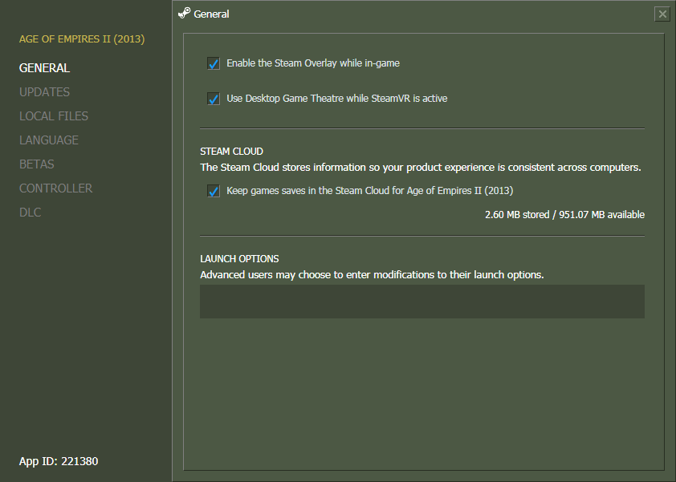
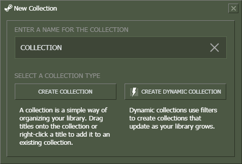
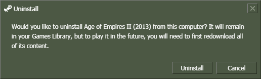

# OG-Steam-Library
Library theme for use with <a href="https://github.com/ungstein/OG-Steam">OG-Steam</a> and <a href="https://github.com/PhantomGamers/SteamFriendsPatcher">SteamFriendsPatcher<a>. A lot of the unnecessary padding as been removed to free up screen real estate.

Installing
-

* Make sure SteamFriendsPatcher.exe is running.
* Copy the **steamui** folder into your Steam installation folder (e.g. "C:\Program Files (x86)\Steam").

 Preview
 -
 
 
 
 
 
